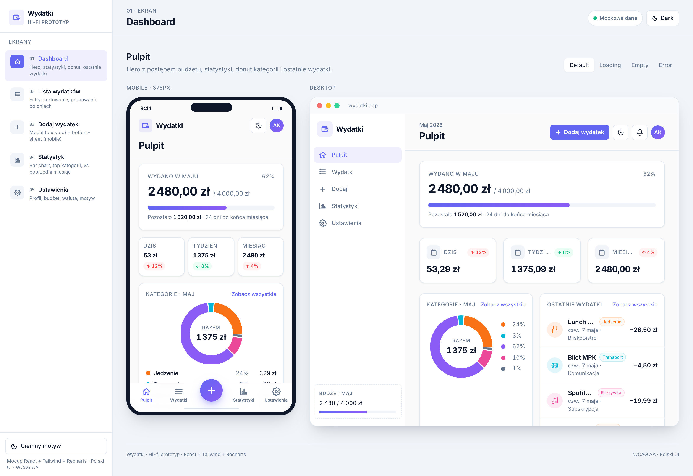
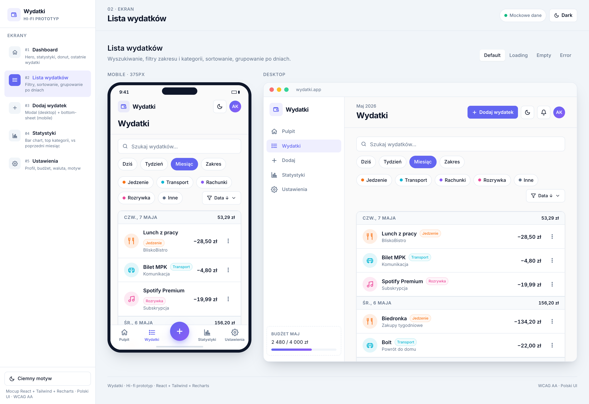
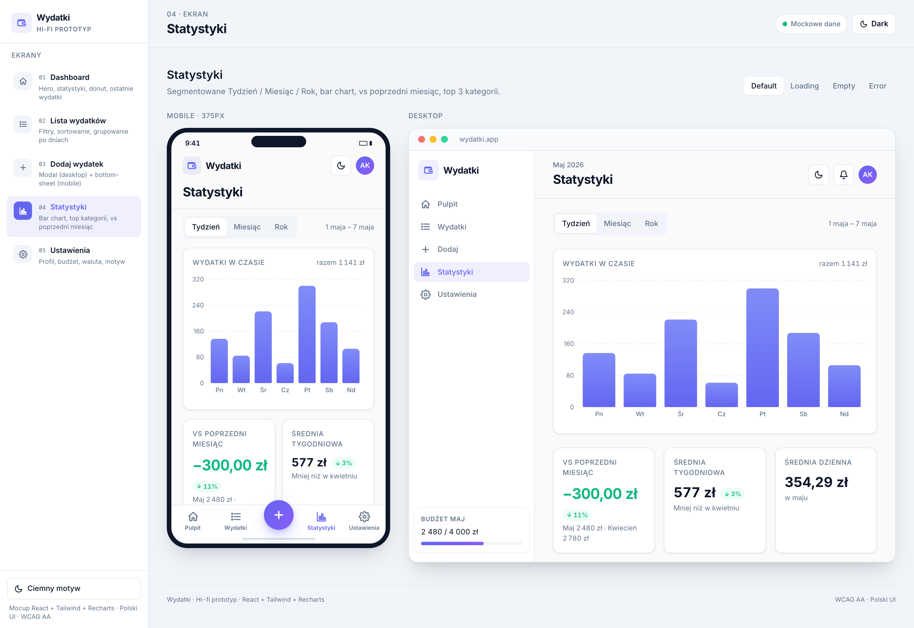
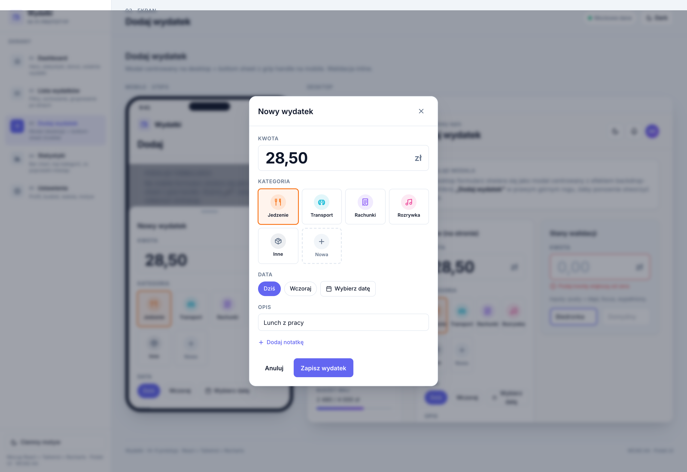
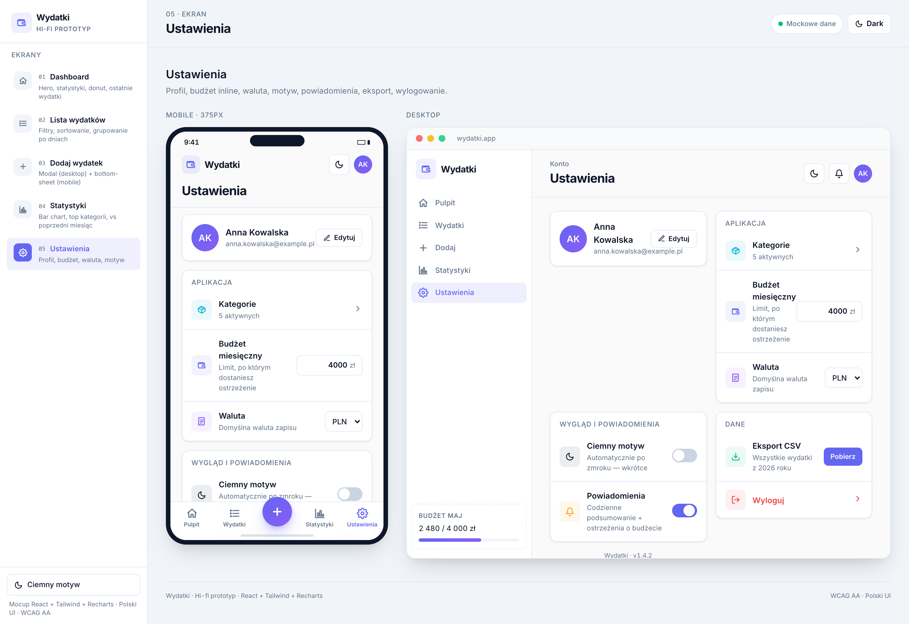
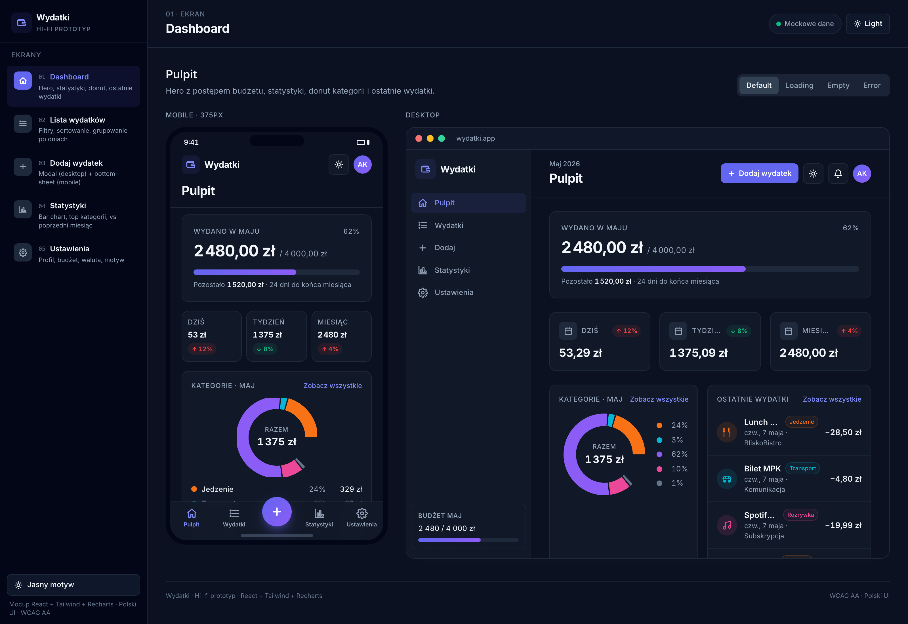

# Wydatki — śledzenie wydatków osobistych

Aplikacja webowa do prostego śledzenia osobistego budżetu: pulpit z postępem miesięcznego budżetu, lista wydatków pogrupowana po dniach, dodawanie i edycja w modalu (bottom-sheet na mobile), statystyki w trzech zakresach czasowych (tydzień / miesiąc / rok), eksport CSV. W całości po polsku, z trybem ciemnym i pełną nawigacją klawiaturą.

> Projekt zaliczeniowy z przedmiotu **UI/UX**.

## 🔗 Demo

**<https://expense-tracker-five-drab-69.vercel.app>**

Dane są mockowane (MSW) i trzymane w `localStorage` przeglądarki — można dodawać, edytować i usuwać wydatki, a po odświeżeniu strony wszystko zostaje. Żeby zacząć od czystego stanu: DevTools → Application → Storage → Clear site data.

## 📸 Wygląd

| Pulpit | Lista wydatków | Statystyki |
|---|---|---|
|  |  |  |

| Dodaj wydatek (modal) | Ustawienia | Tryb ciemny |
|---|---|---|
|  |  |  |

## 🛠 Technologie

| Warstwa | Biblioteka |
|---|---|
| Bundler & dev server | **Vite 6** |
| UI | **React 18** + **TypeScript** (strict, `noImplicitAny`, `exactOptionalPropertyTypes` off, `noUncheckedSideEffectImports`) |
| Routing | **React Router 6** (z patternem background-route dla modali) |
| Styling | **Tailwind CSS 3** (z customowymi tokenami brand/ok/danger) |
| Formularze | **React Hook Form** + **Zod** (resolver) |
| State management | **Zustand** (3 store'y: `settings`, `expenses`, `toast`) z `persist` middleware |
| Mock API | **MSW 2** (Service Worker, `GET / POST / PUT / DELETE`) |
| Wykresy | **Recharts** (PieChart donut + BarChart) |
| Animacje | **Framer Motion** (modale, toasty) z `MotionConfig reducedMotion="user"` |
| Ikony | **lucide-react** |

## 🚀 Uruchomienie lokalne

```bash
git clone https://github.com/bartek-dev-work/expense-tracker.git
cd expense-tracker
npm install
npm run dev
```

Otwórz <http://localhost:5173>. Mock API oraz zestaw startowych wydatków (12 sztuk) ładują się automatycznie.

```bash
npm run build       # produkcyjny build do dist/
npm run preview     # podgląd produkcyjnego builda lokalnie
npm run lint        # type-check (tsc --noEmit)
```

Wymagana wersja Node: **20.0+**.

## 📁 Struktura projektu

```
.
├── src/
│   ├── api/                 # klient HTTP (fetch wrapper z obsługą 204)
│   ├── components/
│   │   ├── layout/          # AppShell, Sidebar (desktop), BottomNav (mobile)
│   │   └── ui/              # Card, Modal, Toaster, PageHeader,
│   │                        # CategoryBadge, CategoryDonut, StatCard,
│   │                        # SegmentedControl
│   ├── lib/                 # categories, format (Intl PL), analytics, csv, seed
│   ├── mocks/               # MSW handlers (REST CRUD) + worker setup
│   ├── pages/               # 5 ekranów: Dashboard, Expenses, AddExpense,
│   │                        # Stats, Settings
│   ├── store/               # Zustand: settings (persist), expenses, toast
│   ├── types/               # typy domeny (Expense, CategoryId, Currency)
│   ├── App.tsx              # routing + background-route pattern dla modali
│   ├── main.tsx             # bootstrap + MSW worker.start
│   └── index.css            # Tailwind + custom (skip-link, prefers-reduced-motion)
│
├── wireframes/              # Pkt 1.1 — prototyp lo-fi
│   ├── wireframes.html      # interaktywny szkic w skali szarości
│   └── screens/             # 6 PNG — okładka + 5 ekranów
├── hi-fi/                   # Pkt 1.2 — prototyp hi-fi
│   ├── *.jsx, index.html    # statyczny prototyp React via CDN
│   └── screens/             # 10 PNG — 5 ekranów × light/dark
├── docs/
│   └── user-flow.md         # Pkt 1.2 — diagram Mermaid + ścieżki
│
├── public/
│   └── mockServiceWorker.js
├── vercel.json              # SPA rewrite + Service-Worker-Allowed header
├── tailwind.config.ts       # tokeny zsynchronizowane z hi-fi (Pkt 1.3)
└── tsconfig.app.json        # strict TS, alias `@/*` → `src/*`
```

## ✅ Pokrycie kryteriów oceny

| # | Kryterium | Pkt | Status | Gdzie szukać |
|---|---|---|---|---|
| 1.1 | Prototyp lo-fi | 0–2 | ✅ | [`wireframes/wireframes.html`](wireframes/wireframes.html) + 6 screenów |
| 1.2 | Prototyp hi-fi z user flow | 0–2 | ✅ | [`hi-fi/`](hi-fi/) + [`docs/user-flow.md`](docs/user-flow.md) |
| 1.3 | Spójność hi-fi ↔ implementacja | 0–2 | ✅ | te same tokeny w [`tailwind.config.ts`](tailwind.config.ts) co w `hi-fi/index.html` |
| 2.1 | Komponenty wielokrotnego użytku | 0–3 | ✅ | [`src/components/`](src/components/) — 11 współdzielonych komponentów |
| 2.2 | Routing (≥3 ekrany) | 0–2 | ✅ | 6 tras w [`App.tsx`](src/App.tsx), background-route dla modali |
| 2.3 | Biblioteka UI | 0–2 | ✅ | Tailwind CSS jako system designu (uzgodniona alternatywa do MUI) |
| 3.1 | Działa mobile + desktop | 0–2 | ✅ | bottom-nav <640, sidebar ≥768, modal vs bottom-sheet |
| 3.2 | ≥2 breakpointy | 0–1 | ✅ | `sm` (640) `md` (768) `lg` (1024) |
| 3.3 | Spójność layoutu | 0–2 | ✅ | jeden token system w Tailwind, `Card`/`PageHeader`/`Toaster` |
| 4.1 | Walidacja klienta | 0–2 | ✅ | Zod schema w [`AddExpense.tsx`](src/pages/AddExpense.tsx) — kwota, kategoria, data, opis, notatka |
| 4.2 | Czytelne komunikaty błędów | 0–2 | ✅ | inline `role="alert"` pod każdym polem, `aria-describedby` |
| 4.3 | Stan formularza | 0–1 | ✅ | RHF (`isSubmitting`, prefill przy edycji) |
| 5.1 | Semantyczny HTML, aria-* | 0–2 | ✅ | `<main>`, `<section aria-labelledby>`, role=dialog/img/switch/radiogroup |
| 5.2 | Kontrast AA (≥4.5:1) | 0–2 | ✅ | tokeny `ok`/`danger`/`brand-600` zweryfikowane axe-core |
| 5.3 | Klawiatura + focus | 0–2 | ✅ | focus-trap w modalu, skip-link, focus-ring na każdym kliknięciu |
| 5.4 | Audyt axe / Lighthouse | 0–2 | ✅ | **0 violations** axe-core na wszystkich 5 stronach |
| 6.1 | Globalny stan | 0–2 | ✅ | Zustand + `persist` middleware (`useSettingsStore`, `useExpensesStore`) |
| 6.2 | Loading / success / error | 0–2 | ✅ | `AsyncStatus` w `useExpensesStore`, skeletony, toast errors, retry button |
| 7.1 | API GET + (POST/PUT/DELETE) | 0–3 | ✅ | wszystkie 4 metody w [`src/mocks/handlers.ts`](src/mocks/handlers.ts) |
| 7.2 | Obsługa błędów sieciowych | 0–2 | ✅ | retry button w error state, error toast przy CRUD, `try/catch` w storze |
| 8.1 | Animacje przejść | 0–2 | ✅ | Framer Motion: backdrop fade, slide-up modal, slide-up bottom-sheet, toast |
| 8.2 | Wizualny feedback | 0–2 | ✅ | toast `Dodano/Zaktualizowano/Usunięto/Zapisano`, hover lift na statystykach, animowany progress bar |
| 8.3 | Framer Motion / CSS transitions | 0–1 | ✅ | Framer Motion + Tailwind transitions |
| 9.1 | Wdrożenie publiczne | 0–1 | ✅ | Vercel + auto-deploy z gałęzi `main` |
| 9.2 | Repo z historią commitów | 0–2 | ✅ | <https://github.com/bartek-dev-work/expense-tracker> |
| 9.3 | README | 0–2 | ✅ | ten plik |

**Bonus +0,5 stopnia**: notatka UX (sekcja niżej).

## ⌨️ Klawiatura

| Skrót | Akcja |
|---|---|
| `Tab` / `Shift+Tab` | Nawigacja między elementami |
| `Esc` | Zamknięcie modala |
| `Enter` na linku w nawigacji | Przejście na ekran |
| `Spacja` na toggle/radio | Przełącznik / wybór |
| Pierwszy `Tab` na stronie | Pojawia się **„Pomiń do treści"** (skip link) |

## 🔬 Audyty

- **axe-core 4.10** — 0 naruszeń na każdej z 5 stron (Dashboard, Lista, Dodaj, Statystyki, Ustawienia)
- **Lighthouse** na produkcji (headless Chrome):
  - Accessibility: **96**
  - Best Practices: **96**
  - SEO: **90**
  - Performance: **79** (limituje wagę bundla — Recharts + Framer Motion + MSW)
- **TypeScript strict** — zero `any`, zero `unknown` (wymóg projektowy z `CLAUDE.md`)
- **Manualny test klawiaturą** — pełne dotarcie do każdego elementu interaktywnego, focus widoczny, modal z trapem

---

## 📝 Notatka UX

### Grupa docelowa

Aplikacja jest celowana w **studentów i młodych dorosłych (20–30 lat)**, którzy chcą mieć kontrolę nad miesięcznym budżetem, ale nie chcą się męczyć z arkuszami kalkulacyjnymi ani aplikacjami bankowymi z dziesiątkami funkcji. Główne use-case'y:

- "Ile wydałem dziś?" — odpowiedź widoczna na pulpicie w 1 sekundę
- "Ile zostało mi z budżetu na ten miesiąc?" — pasek postępu na pulpicie
- "Na co najwięcej idzie?" — donut kategorii + statystyki

### Persona

> **Marta, 24 lata, junior developer w Krakowie**
> Wynajmuje mieszkanie, jada na mieście kilka razy w tygodniu, korzysta z MPK i Bolta. Próbowała Excela — porzuciła po dwóch tygodniach, bo dodawanie wydatku zajmowało za dużo klikania. Chce zobaczyć w 5 sekund, czy mieści się w budżecie, i zrozumieć, gdzie wycieka jej kasa.

Konkretne potrzeby Marty kształtowały kluczowe decyzje:
- **dodanie wydatku w ≤ 3 tapnięcia** — FAB zawsze widoczny, modal z autofocus na polu kwoty, kategoria w siatce ikon
- **kategorie kolorystyczne** zamiast tekstowych — Marta po tygodniu rozpoznaje pomarańczowe kółko = jedzenie szybciej niż etykietę
- **3 wskaźniki czasowe** (dziś / tydzień / miesiąc) — najczęstsze pytanie to "ile dzisiaj wydałam"

### Kluczowe wybory UI/UX i ich uzasadnienie

| Wybór | Uzasadnienie |
|---|---|
| **Modal/bottom-sheet zamiast osobnej strony** dla dodawania | Marta nie traci kontekstu listy; na desktopie modal centrowany, na mobile bottom-sheet z grip handle (znajomy wzorzec z iOS/Android) |
| **Background-route pattern** w React Router | URL `/expenses/new` jest "deep-linkowalny" (można wysłać znajomej), ale wizualnie modal pływa nad poprzednim ekranem |
| **localStorage + MSW** zamiast realnego backendu | Aplikacja jest 100% offline, demo działa bez konta, każdy może wejść i kliknąć — zero friction |
| **Donut z legendą obok** (zamiast pod) | Lepsze wykorzystanie szerokiego ekranu; na mobile grid składa się do 1 kolumny |
| **Polski format kwot i dat** (Intl) | "−28,50 zł", "wt., 7 maja" — nie "-28.50 PLN", "Tue May 7" |
| **Soft shadows + 12px radius** | Zgodne z trendem 2024+ (Linear, Notion) — Marta intuicyjnie rozpoznaje ten "język wizualny" |

### Heurystyki Nielsena (zastosowane)

1. **Widoczność statusu systemu** — skeleton screens podczas ładowania, toast po każdej akcji (`Dodano wydatek`), pasek postępu budżetu jako żywy wskaźnik
2. **Dopasowanie do rzeczywistości** — polskie etykiety, format kwot, polskie nazwy dni („pt., 8 maja"), kategorie życiowe (Jedzenie / Transport / Rachunki / Rozrywka / Inne)
3. **Kontrola i swoboda** — `Esc` zamyka modal, „Anuluj" w formularzu, możliwość edycji każdego wydatku, kosz przy każdym wpisie z `confirm()` przed usunięciem
4. **Spójność i standardy** — jeden komponent `CategoryBadge` używany w 4 miejscach (lista, dashboard, statystyki, modal), te same kolory dla tych samych kategorii w całej apce
5. **Zapobieganie błędom** — `max={today}` na polu daty, walidacja kwoty (>0), wymagana kategoria z domyślnie zaznaczoną „Jedzenie", `confirm()` przed destrukcyjnym usunięciem
6. **Rozpoznawanie zamiast przypominania** — kolorowe ikony kategorii (nie trzeba pamiętać nazw), siatka kategorii zamiast dropdownu w formularzu, dni tygodnia po polsku
7. **Elastyczność i efektywność** — skróty klawiaturowe, Tab nawigacja, focus trap w modalu (zaawansowani użytkownicy nie potrzebują myszki)
8. **Estetyka i minimalistyczny design** — białe karty, soft shadow, dużo pustej przestrzeni, jeden font (Inter), stonowana paleta indygo+slate
9. **Pomoc w rozpoznawaniu i naprawie błędów** — komunikaty błędów inline pod każdym polem (`role="alert"`), retry button w stanie błędu sieci, opisowe toasty błędów
10. **Pomoc i dokumentacja** — placeholdery w polach (`np. Lunch z pracy`), opisy pod każdą sekcją na pulpicie, tooltipy w stat-cards (vs. poprzedni okres)

### User-Centered Design

Decyzje projektowe weryfikowałem trzema „filtrami":

1. **Czy moja persona (Marta) zrozumie to bez tutoriala?** — żadnego onboardingu, ekran pulpitu jest „samowyjaśniający"
2. **Czy mogę to zrobić jedną ręką trzymając telefon?** — FAB w prawym dolnym rogu (kciuk), bottom-nav, modal jako bottom-sheet
3. **Czy to działa offline / w słabym 3G?** — MSW zamiast prawdziwego API, optymistyczne update'y stanu, persystencja w `localStorage`

### Dostępność (WCAG)

Świadomie zaimplementowałem:
- pełen **focus trap** w modalu z roving `tabindex` w `radiogroup` kategorii
- **skip-link** „Pomiń do treści" jako pierwszy element po Tab
- **`prefers-reduced-motion`** — globalny override przez CSS + `MotionConfig` Framer Motion
- **kontrasty AA** zweryfikowane axe-core (token `ok` przesunięty z `#10B981` na `#047857` po wykryciu naruszenia)
- **alternatywne opisy wykresów** — `<p class="sr-only">` z pełną listą kategorii i kwot przed każdym wykresem (screen reader dostaje pełny tekst, sighted user widzi wizualizację)
- **`role="dialog"` + `aria-modal`** + autofocus na pierwszym polu modala, focus wraca do trigger button po zamknięciu

### Co bym zmienił/dodał, gdybym miał więcej czasu

- **Kategoryzacja zwrotna** (np. „już 3 razy wpisywałeś «Lunch z pracy» — zaproponować autouzupełnienie?")
- **Powiadomienia push** o zbliżaniu się do limitu budżetu
- **Eksport per-okres** (obecnie eksportuje wszystko — można by wybrać zakres)
- **Synchronizacja między urządzeniami** (wymagałoby realnego backendu i auth)

---

## 📜 Licencja

MIT — projekt edukacyjny, kod otwarty.
