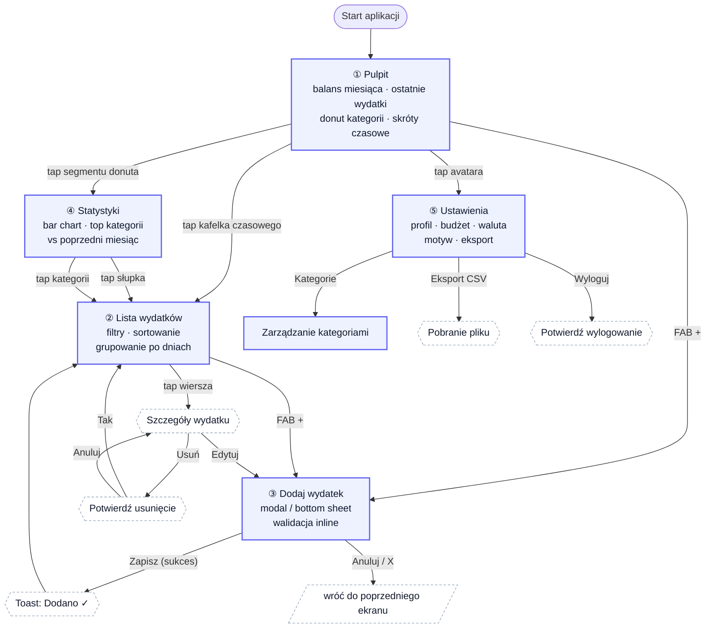

# User Flow — Expense Tracker

Przepływ użytkownika między ekranami aplikacji. Diagram pokazuje typowe ścieżki: od pierwszego wejścia, przez dodanie wydatku, po zarządzanie budżetem.

## Diagram główny

## Kluczowe ścieżki

### Ścieżka 1 — szybkie dodanie wydatku (golden path)
`Dashboard → FAB + → Modal "Dodaj wydatek" → wypełnij kwotę i kategorię → Zapisz → Toast ✓ → powrót do Dashboard`

**Cel:** dodanie wydatku w ≤ 3 tapnięcia. Modal ma autofocus na polu kwoty.

### Ścieżka 2 — analiza wydatków
`Dashboard → tap segmentu donuta (np. „Jedzenie") → Statystyki z filtrem kategorii → tap słupka → Lista wydatków filtrowana po dniu i kategorii`

**Cel:** od ogółu do szczegółu w 3 krokach.

### Ścieżka 3 — edycja wydatku
`Lista → tap wiersza → szczegóły → Edytuj → modal z prefillem → Zapisz → Toast ✓ → Lista`

### Ścieżka 4 — zmiana budżetu
`Dashboard → tap avatara → Ustawienia → inline edit „Budżet miesięczny" → autosave + toast → wracam, pasek w hero karcie się aktualizuje`

## Routing

| Ścieżka URL | Ekran | Komponent |
|---|---|---|
| `/` | Pulpit (Dashboard) | `pages/Dashboard.tsx` |
| `/expenses` | Lista wydatków | `pages/Expenses.tsx` |
| `/expenses/new` | Dodaj wydatek (modal nad listą lub osobny ekran na mobile) | `pages/AddExpense.tsx` |
| `/expenses/:id/edit` | Edycja wydatku | `pages/AddExpense.tsx` (ten sam, prefill) |
| `/stats` | Statystyki | `pages/Stats.tsx` |
| `/settings` | Ustawienia | `pages/Settings.tsx` |

## Stany ekranów (do implementacji)

Każdy ekran z danymi musi obsługiwać 4 stany:

- **Loading** → skeleton screens (animowane szare bloki, nie spinner)
- **Empty** → ilustracja + tekst + CTA „Dodaj pierwszy wydatek"
- **Error** → komunikat + przycisk „Spróbuj ponownie"
- **Success** → docelowa zawartość

## Zasady nawigacji

- **Mobile (< 640px):** bottom navigation, środkowy slot = FAB „+" (skrót do Add).
- **Tablet (640–1024px):** sidebar zwinięty do ikon (44×44px), labelki w tooltipie.
- **Desktop (> 1024px):** pełny sidebar z labelami + skrótami klawiszowymi (`g d` — dashboard, `g l` — lista, `n` — nowy wydatek).
- **Powrót:** `Esc` zamyka modale i sheety, na mobile gest swipe-down.
- **Persystencja stanu:** filtry listy i wybrany okres statystyk zapamiętywane w URL query params.
